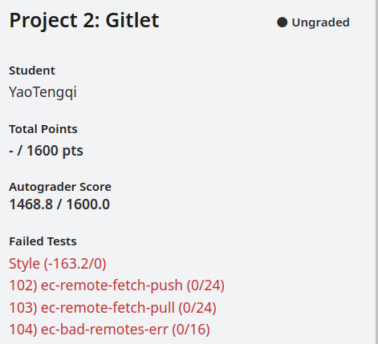

# Gitlet
本项目是编写一个简易版git

**done**

## Classes and Data Structures
### Main
Main文件是整个项目的入口，他根据输入的args[]参数识别命令并执行。

### Blobs

每个blob代表一个文件，保存着文件的具体内容，也是gitlet处理的元数据。

#### 属性

|  属性名  |  格式  |                    描述                    |
| :------: | :----: | :----------------------------------------: |
|  blobID  | String |      每个blob都有一个由SHA-1生成的ID       |
| blobName | String |        每个blob都有一个自己的文件名        |
| content  | byte[] | 每个blob将存储文件的内容，压缩为byte[]格式 |

#### 函数

|                            函数名                            |    返回值    |                             描述                             |
| :----------------------------------------------------------: | :----------: | :----------------------------------------------------------: |
|              public **Blobs**(String fileName)               |      /       |                 根据给定的文件名生成blob对象                 |
|   public static byte[] **readFileToBytes**(File blob_file)   |    byte[]    |         给定文件对象，读取文件中的内容到byte[]后返回         |
|     public static String **calculateID**(byte[] content)     |    String    |             根据文件数据计算出相应的SHA-1哈希ID              |
| public static boolean **trackFiles**(List<Blobs> previousBlobList, Blobs currentBlob) |     int      | 对比两个BlobsList是否一致，即检查上一个commit的BlobsList与当前要添加的blob是否一致 |
| public static List<Blobs\> **returnBlobsList**(List<String\> fileNames, File workStage) | List<Blobs\> |                        返回所有Blobs                         |
| public static boolean **deleteStageFile**(String fileName, String command, Blobs blobFile) |   boolean    |                删除或者添加STAGE_AREA中的blob                |
| public static void **addBlobs**(Commit currentCommit, String blobFileName) |      /       |        command add使用的具体函数，完成具体文件的添加         |

### Commit

每个commit代表一次提交，有一个独一无二的ID，提交信息，提交时间，对blobs的引用以及父亲commit

#### 属性

|  属性名   |     格式     |                  描述                   |
| :-------: | :----------: | :-------------------------------------: |
| commit_ID |    String    |    每个commit都有一个由SHA-1生成的ID    |
|  message  |    String    | 每次提交都会有一个message来描述本次提交 |
|   time    |     Date     |               提交的时间                |
| blobArray | List<Blobs\> |  本次提交所包含的blob，存储在此队列中   |
|  parent   |    commit    |          本次提交的父亲commit           |

#### 函数

|                            函数名                            |    返回值     |                        描述                         |
| :----------------------------------------------------------: | :-----------: | :-------------------------------------------------: |
| public **Commit**(String message, Blobs[] blobArray, Commit parent) |       /       | 根据给定的message,parent以及blobArray生成commit对象 |
|     public static String **calculateID**(byte[] content)     |    String     |         根据文件数据计算出相应的SHA-1哈希ID         |
|               private String **getBlobsID**()                |    String     |   获取所有blobArray中的blobID，被calculateID调用    |
|  public void **writeCommit**(File AREA, String commitName)   |       /       |             将此commit写入给定的AREA中              |
|   public void **clearStageArea**(List<String\> fileNames)    |       /       |           提交完commit后将STAGE_AREA清空            |
| public static boolean **updateBlobArray**(Commit updateCommit, List<Blobs\> previousBlobArray, List<String\> fileNames, String command) |    Boolean    |                更新Commit的BlobArray                |
| public static List<Commit\> **returnCommitList**(Commit currentCommit) | List<Commit\> |      根据父亲指针循环获取Commit得到CommitList       |
|                                                              |               |                                                     |

### Repository

Repository负责对文件夹进行操作

#### 属性

|   属性名    |    格式    |                 描述                  |
| :---------: | :--------: | :-----------------------------------: |
|     CWD     | final File |          当前工作的文件路径           |
| GITLET_DIR  | final File |             .gitlet的路径             |
| STAGE_AREA  | final File | 暂存区路径，用于存储add指令添加的文件 |
| COMMIT_AREA | fina File  |       用于存储每次commit的对象        |
|  HEAD_AREA  | fina File  |     用于存储每次head头指针的对象      |

#### 函数

|               函数名                | 返回值 |         描述          |
| :---------------------------------: | :----: | :-------------------: |
|   public static void makeSetup()    |   /    |  初始化.gitlet文件夹  |
| public static void makeStageArea()  |   /    | 创建STAGE_AREA文件夹  |
| public static void makeCommitArea() |   /    | 创建COMMIT_AREA文件夹 |

### Checkout

专门处理checkout相关的操作

#### 函数

|                            函数名                            | 返回值 |                             描述                             |
| :----------------------------------------------------------: | :----: | :----------------------------------------------------------: |
| public static boolean **checkUntracked**(Commit currentCommit, String fileName) |   /    |               检查fileName是否为未被追踪的文件               |
| public static boolean **checkoutFile**(Commit currentCommit, String fileName) |   /    |                 回退到当前current的file版本                  |
| public static Commit **checkoutCommitFile**(Commit currentCommit, String fileName, String commitID, boolean resetFlag) |   /    | 回退到特定commit版本(通过commitID查询)的指定file，会调用`checkoutFile()` |
| public static Commit **resetCommitFile**(Commit currentCommit, String commitID) | Commit | 完成reset操作：退回到特殊commit版本的文件内容，并删除未追踪的文件 |
| ``public static File findBranch(Commit currentCommit, String branchName, List<String> branchFileNames)`` |  File  |                 查找该branch名的分支是否存在                 |

### Merge

**Modified or Add in Both branches**

**Add and Remove**

#### 函数

|                            函数名                            |           返回值            |                             描述                             |
| :----------------------------------------------------------: | :-------------------------: | :----------------------------------------------------------: |
|              `findSplitAncestor(master, other)`              |          `Commit`           |   找到两个branch的最近祖先节点(**Latest ancestor commit**)   |
|          `findSameBlob(currentCommit, otherCommit)`          |        `List<Blobs>`        | 找到两个`commit`的同名`BlobList`同时得到不同名的`BlobList`，分别为`currentDifferentBlobList`以及`otherDifferentBlobList` |
| `sameBlobListTraversal(List<Blobs> sameBlobList, Commit ancestor)` | `List<Blobs> mergeBlobList` | 对同名`Blob`进行处理，并处理后的`Blob`写入`mergeBlobList`中  |
|                    `findSameNameInOther`                     |           `Blobs`           | 通过文件名找到other branch中相同文件名的blob，为了与ancestor以及master中的内容进行比较 |
|                      `resolveConflict`                       |           `Blobs`           | 解决文件冲突的问题，即将当前branch的内容写在前面，而把另一branch的内容写在后面 |
| `findDeleteBlobs(Commit ancestor, List<Blobs> mergeBlobList)` |  `List<Blobs> deleteBlobs`  | 当在祖先commit中存在的blob在任意一个branch中不复存在时将其删除(如果在WORK_AREA中存在，也要删除工作区文件) |
| ``static List<Blobs> resolveChangeDeleteFile(List<Blobs> ancestorBlobList, List<Blobs> currentBlobList, List<Blobs> otherBlobList)`` |      ``List<Blobs> ``       | 处理存在于祖先节点，并在一个branch中改变，另一个branch中删除的conflict情况 |
|                                                              |                             |                                                              |

#### 问题

1. merge后的commit应该有两个parent commit，因此寻找祖先节点时也应该根据这**两个**parent commit寻找...

## Persistence

.
├── gitlet
│   ├── Blobs.class
│   ├── Blobs.java
│   ├── Checkout.class
│   ├── Checkout.java
│   ├── Commit.class
│   ├── Commit.java
│   ├── Dumpable.class
│   ├── Dumpable.java
│   ├── DumpObj.class
│   ├── DumpObj.java
│   ├── GitletException.class
│   ├── GitletException.java
│   ├── Main.class
│   ├── Main.java
│   ├── Makefile
│   ├── Repository.class
│   ├── Repository.java
│   ├── sentinel
│   ├── test.txt
│   ├── Utils$1.class
│   ├── Utils.class
│   └── Utils.java
├── gitlet-design.md
├── Makefile
├── myTest
│   ├── dangerous.txt
│   ├── lxx.txt
│   └── other.txt
├── pom.xml
├── readme.md
├── target
│   ├── classes
│   │   └── gitlet
│   │       ├── Blobs.class
│   │       ├── Checkout.class
│   │       ├── Commit.class
│   │       ├── Dumpable.class
│   │       ├── DumpObj.class
│   │       ├── GitletException.class
│   │       ├── Main.class
│   │       ├── Repository.class
│   │       ├── Utils$1.class
│   │       └── Utils.class
│   └── generated-sources
│       └── annotations
└── testing
    ├── Makefile
    ├── runner.py
    ├── samples
    │   ├── definitions.inc
    │   ├── test01-init.in
    │   ├── test02-basic-checkout.in
    │   ├── test03-basic-log.in
    │   └── test04-prev-checkout.in
    ├── src
    │   ├── notwug.txt
    │   └── wug.txt
    ├── staff-runner.py
    ├── student_tests
    │   └── definitions.inc
    └── tester.py

## IDEAL

1. `public static boolean updateBlobArray(Commit updateCommit, List<Blobs> previousBlobArray, List<String> fileNames, String command)`函数中，需要一个tempBlobArray来操作存储变化的新BlobArray，因为直接令tempBlobArray = previousBlobArray的话他们俩指向的是同一块地址，操作tempBlobArray时previousBlobArray指向的内容也变换导致所有commit的BlobArray也随之变换出现问题。
2. 用shortID查询commitID完成相应的`java gitlet.Main checkout [commit id] -- [file name]`功能会影响速度，Git的解决办法是把Blobs们依据**哈希值**的前两位建立文件夹进行存储，查找时只需算出哈希值就可以快速查找(O(1))。
3. **2024.6.4**测试很重要，用写好的测试脚本来测试效率较高且方便，是一劳永逸的方法，无需再手动测试，因此学会如何写测试脚本十分重要，与写开发文档的思想是一样的，都是为了更规范与方便高效。
